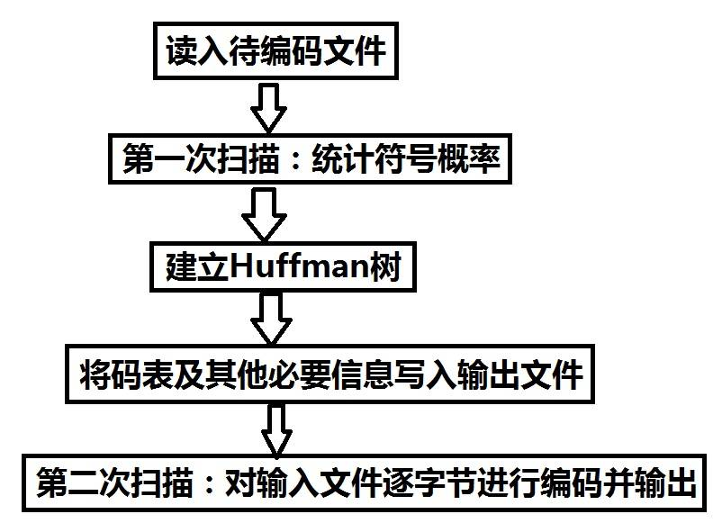

# Project 1开发文档

## 一、项目文件结构说明

项目共包括5个文件：main.cpp；Heap.h；HuffmanTree.h；Tools.h；Tools.cpp。下面根据依赖关系逐个说明：

### 1、Heap.h

在该文件中定义了一个二叉堆模板类Heap，是一个自调整的数据结构，存储结构为顺序存储，每次插入或删除元素后会将最小（元素的大小关系的比较用传入的参数类重载的()运算符判断）的元素位于队首。该文件中实现了该数据结构创建、插入、取出元素、得到元素个数的函数。部分关键变量和函数声明如下：

```c++
template<typename T, class Compare = Less<T>>
class Heap{
public:
    Heap() {}
    Heap(T* t, int size);
    inline void push(const T& t);
    void pop();
    bool empty() {return data.empty();}
    T& front() {return data[0];}
};
```

### 2、HuffmanTree.h

在该文件中首先定义了哈夫曼树结点的模板类HuffmanNode，结点的结构为：数据 + 权重 + 左右孩子指针 + 父节点指针，结点的每次构造都需要传入该结点对应的权重参数（可以没有确定的数据但一定要有权重）。其次借助结点定义了哈夫曼树的模板类HuffmanTree，实现了通过传入的数据和权重构造哈夫曼树和获取哈夫曼编码的函数。需要注意的是，哈夫曼树本身并不消耗空间存储数据及对应的哈夫曼编码，哈夫曼编码需要通过传入哈希表获取。部分关键变量和函数声明如下：

```c++
template<typename T>
struct HuffmanNode {
    T data;
    Long weight;
    HuffmanNode<T>* left, * right, * parent;
    HuffmanNode(Long w, const T& t = T()) :	//构造结点时一定要由权重参数
    data(t), weight(w), left(nullptr), right(nullptr), parent(nullptr) {}
};
template<typename T>
class HuffmanTree {
public:
    HuffmanTree() : root(nullptr) {}
    HuffmanTree(std::map<T, Long> hash);	//通过哈希表构造哈夫曼树
    Node* getRoot() const {return root;}
    void getCode(HashMap& hash);			//哈夫曼编码通过传入哈希表获取
    ~HuffmanTree() { destroy(root); }
};
```

### 3、Tools.h与Tools.cpp

在该文件中定义了一个文件处理抽象类Tool，继承出Compress（负责压缩文件）与Decompress（负责解压文件）两个子类。Tool类中存储了当前处理的文件的词频信息和哈夫曼编码信息。同时定义了三个压缩单元的属性参数：F_FILE、F_START和F_END，不同属性的压缩单元的信息存储结构不同。Compress类是压缩类，将传入路径的内容解压到目标路径。此处需要注意传入的是完整路径而不是单纯的文件（或文件夹）名，解压后在目标路径文件夹中生成扩展名为.huf的压缩文件。Decompress类是解压类，将传入路径上的压缩文件解压到目标路径，若压缩文件内容为文件，则在目标路径文件夹中产生与原文件同名的文件；若压缩文件内容为文件夹，则在目标路径文件夹中产生于原文件夹同名的文件夹，并将文件夹的内容解压到新建的文件夹中。同样需要注意传入的是完整路径，同时要求文件扩展名为.huf。部分关键变量和函数声明如下：

```c++
class Tool{
protected:
    static const unsigned char F_FILE = 0x01;   //文件标志
    static const unsigned char F_START = 0x02;  //文件夹开始标志
    static const unsigned char F_END = 0x04;    //文件夹结束标志
public:
    virtual void work(std::string path_in, std::string path_out) = 0;
};

class Compress : public Tool {
protected:
    bool getCode(std::string filename);								//获得文件filename产生的哈夫曼树
    void compressSingle(std::string path_in, std::string path_out);		//压缩单独的文件（或文件夹）
    void getFiles(std::string path_in, std::vector<std::string>& vec);	//得到该路径中的所有项
public:
    void work(std::string path_in, std::string path_out);
};

class Decompress : public Tool {
protected:
    HuffmanTree<char>* getHuffmanTree(std::ifstream& ifs, Long& count);	//重建哈夫曼树
    void decompressFile(std::string path_out, std::ifstream& ifs);	//读取到文件压缩单元时解压文件
public:
    void work(std::string path_in, std::string path_out);
};
```

### 4、main.cpp

与用户对接，读取处理用户输入进行提示，并进行压缩和解压。

## 二、项目设计、实现的具体思路

### 1、哈夫曼树的构建与哈夫曼编码的获取

#### （1）哈夫曼树的构建

哈夫曼树的创建过程使用一个辅助最小堆minHeap。在此次Project中对哈夫曼树的构造函数进行了限制，只能通过哈希表传入数据及对应的权重来构建（如果需要可以在实现其他方式的构造函数，在此次Project中没有用到），每读取一个数据对，通过读取到的数据和权重创建哈夫曼树结点对象，并将其入堆。所有结点均入堆后开始创建哈夫曼树：当minHeap,size()大于1时，从堆中取出两个结点left和right，并用两者权重之和创建父节点，调整好所有指针后父节点指针入堆并继续循环。最终哈夫曼树的根结点为minHeap.size() = 1时堆中的元素。

通过该方式构建哈夫曼树有两种情况比较特殊：**第一种为哈夫曼树为空树（root = nullptr）；第二种为哈夫曼树只有根节点root。这两种情况均会导致无法产生合适的哈夫曼编码。**第一种情况说明文件为空文件，对压缩和解压无影响；第二种情况说明文件全文只有一种字符，该种情况会导致无法正确压缩正文和解压正文。该情形下的文件压缩和解压问题尝试的解决方法写在后面第四部分。

#### （2）哈夫曼编码的获取：

此处暂不考虑上面提过的两种特殊情况，是字符种类数 >= 2的情况下哈夫曼编码的获取。

获取编码思路：采用递归的方式获取，在函数中用一个string型变量code（code最初为空字符串）贯穿整个递归过程，每次递归将当前code后增加一个字符（进入左子树增加字符0，进入右子树增加字符1），当到达叶子节点时将叶子节点中字符数据的哈夫曼编码记录为当前的code并结束该子树的遍历。最终扫完所有叶子节点时将哈希表中数据填充完整，获取哈夫曼编码结束。

另外考虑到一个文件的压缩过程不会频繁获取哈夫曼编码，获取过程只会发生一次（解压过程实质上不需要得到具体的哈夫曼编码），所以不再浪费哈夫曼树中的空间来存储每个字符的哈夫曼编码，而是通过传入哈希表的引用类型变量将哈夫曼编码直接记录到传入的哈希表中以供解压使用。

### 2、三种压缩单元的信息结构

在Project 1种，为了统一不同文件属性（文件或文件夹）的压缩信息便于解压，压缩单元共分为3种，下面逐个解释说明各自的结构：

1. 文件夹开始标志压缩单元 （F_START）
2. 文件夹结束标志压缩单元 （F_END）
3. 文件内容压缩单元（F_FILE）

#### （1）文件夹开始标志压缩单元的信息结构

文件夹开始标志压缩单元的信息结构由三部分组成：第一部分为属性标志state（解压时固定读取1字节）；第二部分为该文件夹名所占字节大小size（解压时固定读取1字节）；第三部分为文件夹名name（解压时读取size个字节）。图解如下：


#### （2）文件夹结束标志压缩单元的信息结构

文件夹结束标志压缩的单元的信息结构由一部分组成：属性标志state（解压时固定读取1字节），当发现读取到state为F_END时直接开始下一个压缩单元的读取即可。图解如下：


#### （3）文件内容压缩单元的信息结构

文件内容压缩单元的信息结构大体由三部分组成：

第一部分为属性标志state（解压时固定读取1字节）；

第二部分为文件名信息，包括两个信息域：文件名大小size（解压固定读取1字节）和文件名称（解压读取size个字节）；

第三部分为文件内容信息，包括三个信息域：文件词频信息（解压时一直读取到结束标志flag）、文件词频信息结束标志flag（解压时固定读取1 + 8字节(**设计为该大小是为了避免原文出现ASCII码为0的字符会导致flag出错**)，且该字节内容为0x00，可以保证第一次遇到该字节时肯定时作为结束标志flag存在）和文件正文信息（解压时循环读取字节，每解压出一个字符count自减1，一直到count为0时读取结束）。该压缩单元第三部分以count为0作为结束，当count为0时也标志着该压缩单元解压结束，开始下一个压缩单元的读取。图解如下：（图中Long型的大小书写有误，应该是8Byte，且该结构在后续有略微优化）


该信息存储结构需要注意的是：对于空文件的压缩，为保持信息存储结构的统一性，压缩前大小为0，压缩后不会为0（因为存储了该文件的属性、文件名与文件字符数信息）。

**因为三种压缩单元的结束位置都是可控的，所以无需另外花费空间来存储压缩单元结束的信息。**

1. 文件夹开始标志压缩单元以**文件夹名结束位置**为结束，该位置通过存储文件夹名大小的信息字节来控制
2. 文件夹结束标志压缩单元以**文件夹结束标志F_END**为结束
3. 文件内容压缩单元以**文件字符信息count为0**为结束

### 3、压缩思路

因不确定传入的路径是文件还是文件夹，需要先对传入的路径进行解析处理，用一个数组存储所有需要压缩的单元，然后再逐个压缩。

#### （1）对传入路径的处理（对应代码中getFiles()函数）

首先判断传入路径是文件还是文件夹：若是文件，则直接将该文件的完整路径入数组；

若是文件夹，则定义一个string对象，对象内容为'<' + 文件夹完整路径，并将该对象入数组，这里**用'<'表示文件夹开始，该'<'未匹配前所有文件与文件夹都在该文件夹内。**紧接着遍历该文件夹的目录，若遇到文件则文件路径入数组，若遇到子文件夹则递归调用getFiles()函数处理该文件夹。当文件夹目录遍历完成后，定义一个string对象，对象内容为'>'，并将该对象数组，这里**用'>'表示该文件夹结束，后面再遇到的其他文件（夹）不在该文件夹内。**通过一个类似栈括号匹配的方式处理文件夹的目录结构。

路径处理结束后，数组vec中可能存在的对象有三种，其与压缩单元的对应如下：

1. 普通的文件完整路径名	->	F_FILE
2. '<' + 文件夹完整路径名    ->    F_START
3. ​           '>'                          ->    F_END

#### （2）单一文件的压缩思路

单一文件的压缩思路分两个部分。第一部分：初次扫描文件获取词频信息，构造哈夫曼树；第二部分：输出解压所需信息后，再次扫描原文件，逐字符读取将解压后的文件输出。思路图如下：



编码后文件的输出思路：对编码后的文件写入时用二进制（且追加）的方式打开文件，利用ofstream类的write()函数，将编码后的每8 bit数据（char型变量存储）写入目标文件。得到编码后8 bit数据对应的char类型变量result：第二遍逐字节读取原文件时，用string类对象code存储其对应的哈夫曼编码，当code长度不足8位时，继续逐字节读取原文件，并将新字符对应的哈夫曼编码接在code结尾上；当code长度达到8位时，通过左移运算将code的前8位一次写入result中，若code[i] = '0'，则result = result << 1；若code[i] = '1'，则result = (result << 1 ) | 1。然后将result利用ofs.wirte()写入压缩文件，随后继续读取原文件。关键代码如下：

```c++
while(ifs.read(&c, sizeof(char))) {
        string tempCode = inf[c];
        code += tempCode;
        k = code.length();
        result = 0;
        while(k >= 8) {  //将之前剩下的字符和当前字符存到一个字节写入文件中
            //通过位运算逐个bit输出
            for(int i = 0; i < 8; i++) {
                if(code[i] == '1') result = (result << 1) | 1;
                else result = result << 1;
            }
            ofs.write((char*)&result, sizeof(char));
            //输出8位bit后调整待输出的哈夫曼编码信息
            code.erase(0, 8);
            k = code.length();
        }
    }
```

一个小细节：当原文件读取完成后，code可能还没有完全写入压缩文件，此时需要将不足8位的code右侧补0随后写入压缩文件，避免信息的损失。

### 4、解压思路

解压时需要先判断文件扩展名是否为.huf，因为编码规范的限制，不是由Compress工作类产生的压缩文件无法由Decompress工作类解压。对于正确的压缩文件，基于三种压缩单元类似但不相同的信息结构，需要一个路径参数path贯穿整个解压过程。（path初始化为传入的目标路径）读取压缩文件并逐个压缩单元解压，解压时先判断待解压单元的属性，三种不同属性对应三种不同操作，操作如下：

#### （1）F_START与F_END压缩单元的解压

F_START压缩单元意味着新建并进入文件夹。读取文件名信息folder_name，（当size > 0时逐个字符读取，size为0标志文件夹名读取完成）随后在当前路径下创建文件夹folder_name，同时将路径修改为path + '\\' + folder_name。修改路径意味着后续的文件和文件夹均在当前文件夹内部创建，以这种方式保留了原来的文件目录。F_END压缩单元意味着当前目录创建完成，应该回到上层目录，只需将path修改为当前路径的上层目录即可，此后所有的文件（夹）都不会在当前文件夹中创建。

#### （2）F_FILE压缩单元的解压

首先读取文件名信息，读取方式和F_START压缩单元的读取方式一致。然后读取各个词频，调用getHuffmanTree()重建哈夫曼树，读取到flag（连续5字节0）时结束。

对于正文的解压思路：按字节读取压缩文件，每8 bit进行一次解码（8 bit编码的获取通过按位或运算来得到并存入字符串inf），解码的方式用一个指向哈夫曼树节点的指针node（初始化为根节点root），逐bit对node进行操作，若node指向叶子节点，则将该叶子节点的数据写入字符串result，同时将node重置为root；若该bit为0，则node = node -> left；反之则node - node -> right。关键代码如下：

```c++
for(int i = 0; i < 8; i++) {
        //当遇到叶子结点时，将对应字符记录，并重置node
        if(node->left == nullptr && node->right == nullptr) {
            result += node->data;
            node = root;
        }
        if(inf.at(i) == '0'/*字符0不是数字0！！！*/) node = node->left;
        else node = node->right;
    }
    //当遇到叶子结点时，将对应字符记录，并重置node
    if(node->left == nullptr && node->right == nullptr) {
        result += node->data;
        node = root;
    }
    //当前8 bit解码完成后清空
    inf.erase(0, 8);
```

需要注意解压结束的条件是count == 0。因为压缩时将不足8位的哈夫曼码用0补齐8位，用来补齐的若干给0可能会解压出有效但多余的字符，造成解压错误。解压只需要从头到尾一遍读取压缩文件，压缩文件读取结束时解压也结束。

## 三、性能测试结果

### 1、测试结果

对test1中的35个文件均进行了测试及数据统计：各个文件的压缩结果对比数据在文件compress.xlsx中，每个文件的字符词频数据在文件frequency.xlsx中（sheet1为各个文件的词频数字信息，sheet2为各个文件的词频分布图），每个文件的字符哈夫曼编码及码长在文件code.txt中。将文件压缩前大小 / 文件压缩后大小的比值结果分为了5个区间：<0.5，0.5~0.9，0.9~1.15，1.15~1.8，>1.8。在此从每个区间中挑取两个例子进行分析：

| 文件名（< 0.5） | 压缩前大小 | 压缩后大小 | 压缩前后比值 | 平均码长 |
| :-------------: | :--------: | :--------: | :----------: | :------: |
|      4.gz       |    143     |    1061    |    0.135     |   6.63   |
|     30.ram      |     35     |    244     |    0.143     |   4.49   |

4.gz与30.ram文件的词频分布图如下：


| 文件名（0.5~0.9） | 压缩前大小 | 压缩后大小 | 压缩前后比值 | 平均码长 |
| :---------------: | :--------: | :--------: | :----------: | :------: |
|      12.gif       |    2941    |    5067    |     0.58     |   7.47   |
|      29.wav       |    4732    |    6860    |     0.69     |   7.82   |

12.gif与29.wav文件的词频分布图如下：


| 文件名（0.9~1.15） | 压缩前大小 | 压缩后大小 | 压缩前后比值 | 平均码长 |
| :----------------: | :--------: | :--------: | :----------: | :------: |
|       20.mov       |  1687192   |  1708974   |     0.99     |   8.09   |
|       35.avi       |   34180    |   32577    |     1.05     |   7.08   |

20.mov与35.avi文件词频分布图如下：


| 文件名（1.15~1.8） | 压缩前大小 | 压缩后大小 | 压缩前后比值 | 平均码长 |
| :----------------: | :--------: | :--------: | :----------: | :------: |
|       9.htm        |   513438   |   373634   |     1.37     |   5.81   |
|       24.wrl       |   18777    |   13596    |     1.38     |   5.49   |

9.htm与24.wrl文件词频分布图如下：


| 文件名（1.15~1.8） | 压缩前大小 | 压缩后大小 | 压缩前后比值 | 平均码长 |
| :----------------: | :--------: | :--------: | :----------: | :------: |
|       22.igs       |  1367604   |   696676   |     1.96     |   4.07   |
|       5.hpgl       |   97229    |   49301    |     1.97     |   4.03   |

22.igs与5.hpgl文件词频分布图如下：


test1 - single file剩余文件与test2 - folder、test3 - empty file and empty folder、test4 - large file的测试结果均在文件compress.xlsx中。

压缩时间与文件大小的关系图如下：


### 2、结果分析

正文本身压缩效率：可以发现在文件大小并非很小时（压缩文件中除正文外的一些信息大小影响不大），正文的压缩效率取决于文件本身词频分布，一方面词频分布的越平均压缩效率越低，甚至压缩后文件会比源文件更大；而词频分布方差较大的文件压缩效率比较高。另一方面字符的种类越少压缩的效率就相对越高，因为字符少了之后字符的哈夫曼编码码长会整体减少。

而且经过数据处理发现，文件的压缩效率与文件的哈夫曼编码平均码长关系如下：


排除几个很小的原文件后可以看出哈夫曼压缩效率与平均码长成线性关系。

整体压缩效率：整体压缩文件包括解压信息 + 正文。当正文比较大时解压信息对压缩效率影响较小，但当正文很小时会对压缩效率产生很大影响。所以可以通过优化解压信息结构来提高对较小文件的压缩效率。

## 四、遇到的问题和解决方案

### 1、扫描文件时词频的获取

在第一次扫描文件时，需要用二进制逐字节读取字符存储词频，但char的范围是-128~127，用读取到的字符表示数组下标会产生越界的问题。

一种解决方案是用unsigned char型变量读取字节，然后每次读取将变量的频率自增1，代码如下：

```c++
Long frequency[256] = {0};
unsigned char c;
while(ifs.read((char*)&c, sizeof(unsigned char))) frequency[c]++;
```

另一种方案是用哈希表来存储词频（std::map<char, Long>），每读取一个字符，若该字符已在哈希表中，则自增1，若未在哈希表中，则增加该项并初始化为1。代码如下：

```c++
std::map<char, Long> hash;
char c;
while(ifs.read(&c, sizeof(char))) {
    if(hash.find(c) != hash.end()) hash[c]++;
    else hash[c] = 1;
}
```

两种解决方案相比之下，第一种更适合存储字符种类较多的文件，减少调用函数的一些开销；第二种更适合存储字符种类较分散的文件，可以省去不必要的内存空间。（Project中采用的是哈希表的方式）

### 2、对bit的操作

在压缩和解压时需要通过二进制的方式逐bit写入压缩文件或从文件中读取bit流。经查阅资料，c++中没有可以通过赋值直接将变量的二进制编码设置为0或1和直接读取二进制编码的方式，在这里产生了问题，无法将解压后的二进制码一个个写入压缩文件，也无法获取压缩文件的二进制码。

解决方案为：以byte为最小单位操作，写入二进制码时利用左移位运算符<<，从左到右将待写入的二进制码按顺序设置到一个byte中，因以byte为最小单位，所以需要一次性设置8位bit后再写入文件（调用ifs.read()函数）；从压缩文件读取的字节中得到二进制码时利用按位与运算符&，分别判断与0x80，0x40，0x20，0x10，0x08，0x04，0x02，0x01进行按位与&运算的结果得到从最左到右的二进制码，随后根据二进制码进行操作。代码如下：

```c++
//写入二进制码，通过左移位运算逐个bit设置到char型变量中
for(int i = 0; i < 8; i++) {
    if(code[i] == '1') c = (c << 1) | 1;
    else c = c << 1;
}
//读取二进制码，通过逻辑与运算的结果逐bit判断0与1
for(unsigned char i = 0x80; i > 0; i = i >> 1)	//这里要用无符号char型变量
    code += ((i & c) != 0) ? "1" : "0";
```

### 3、文件夹结构的压缩与解压

对于文件夹的压缩需要保存文件夹结构，并在解压时恢复原文件夹的结构。该问题的解决方案参考了括号匹配的方法（类似栈的使用）。

压缩：在处理路径获取所有压缩文件的路径时，将文件夹也当作待压缩的路径保存到数组中，保存时与普通的文件保存方式区分开，用'<'符号作为文件夹开始的标志（该符号不会出现在普通文件的路径名开头），用'>'作为文件夹结束的标志，这两个元素分别在遍历文件夹开始前和遍历文件夹结束后加入数组（保证该文件夹的内容都在'<'与'>'间，从而保存文件夹结构），后面以数组中的元素为单元逐个压缩，当压缩到'<'单元时，用F_START的单元结构处理，当压缩到'>'元素时，用F_END的单元结构处理。关键代码（部分省略）如下：

```c++
void Compress::getFiles(string name_in, vector<string>& vec) {
    //TODO:判断传入的文件属性
    
    //若是文件夹，则先将文件夹开始标志进数组，再查找文件夹中所有文件
    vec.push_back(string("<") + name_in);
    //循环遍历文件夹内容
    do{
        if(fileInfo.attrib & _A_SUBDIR) {
            //TODO:判断文件夹名称是否为'.'或 '..'
            
        	//若为子文件夹，则搜查子文件夹，并将"start"入数组（用类似栈的结构存储文件夹之间的目录信息）
            getFiles(name_in + "\\" + fileInfo.name, vec);
        }
        else vec.push_back(name_in + "\\" + fileInfo.name);	//若是子文件，文件路径进数组
    } while(……)
    //文件夹结束标志入数组
    vec.push_back(">"); 
```

解压：文件夹结构的还原和保存思路一致，解压到F_START单元时，在当前路径上创建并进入新文件夹，后面的内容都是文件夹的内容；解压到F_END单元时，说明当前文件夹解压结束，回到上层目录继续解压。关键代码（部分省略）如下：

```c++
void Decompress::work(string filename_in, string path_out) {
    //TODO:解压文件的校验
    
    //开始逐个解压每个压缩单元
    unsigned char state;
    while(ifs.read((char*)&state, sizeof(unsigned char))) {
        //若压缩单元属性为文件内容
        if(state & F_FILE) {
            decompressFile(path_out, ifs);	//解压该文件
            continue;
        }
        //若压缩单元属性为文件夹开始，创建并进入新的文件夹
        if(state & F_START) {
            //TODO:创建一个文件夹folder_name
            
            path_out = path_out + "\\" + folder_name;
            continue;
        }
        //若压缩单元为文件夹结束，回到上层目录
        if(state & F_END) {
            int index = path_out.find_last_of("\\");
            path_out = path_out.substr(0, index);
            continue;
        }
    }
}
```

### 4、只有一种字符的文件的压缩

全文只有一种字符的文件进行哈夫曼压缩时，问题在于无法获得哈夫曼编码，导致无法压缩。解决方案是在压缩和解压的时候加一个判断，压缩时获取词频后，若发现只有一种字符，则在输出flag后不再输出正文，解压时直接根据词频处的出现次数得到原文件，经测试改方法可行，关键代码如下：

```c++
void Compress::compressFile(string file_path, ofstream& ofs) {
    //TODO:输出解压所需信息
    
    if(ch_counts.size() == 1) return;   //若只有一种字符，则不再压缩正文
    //TODO:输出正文
    
}

void Decompress::decompressFile(string path_out, ifstream &ifs) {
    //TODO:读取解压信息
    
    //根节点左右孩子为空，则说明只有一种字符
    if(node != nullptr && node->left == nullptr && node->right == nullptr) {
        char c = node->data;
        while(count-- > 0) ofs.write(&c, sizeof(char));
        return;
    }
    
    //TODO:正常情况下的解码输出
    
}
```

### 5、路径合法的判断

在用户输入后首先应该判断路径是否合法，解决方案是通过正则表达式进行匹配，判断用户的输入是否为合法路径，代码如下：

```c++
bool Tool::isPath(string name) {
    std::regex reg("^[a-zA-Z]:\\\\[^/:*?\"<>|]+$");	//路径匹配模式
    bool ret = std::regex_match(name, reg);
    return ret;
}
```

在判断用户输入为合法路径后，压缩时需要另外判断目标路径是否是扩展名为.huf的压缩文件，解压时需要判断输入路径是否是扩展名为.huf的压缩文件以及目标路径是否为文件夹而非文件，若是文件夹并且文件不存在则创建目标路径上的文件夹。

## 五、优化技巧

### 词频的存储优化

目前在该项目中词频的信息不管大小都由Long（long long）存储，需要占8个字节，一方面文件可能本身不大，并不需要Long型来存储大小；另一方面可能只有部分字符出现的次数较多需要用Long型变量，而其他大部分字符出现次数极少，这时无差别的用Long型存储显然会造成不必要的空间浪费。

优化方式：改变词频信息的存储结构，划分成3部分：字符 + 字节数（记录该词频用到的字节数） + 词频，这样可以通过字符本身改变字符词频信息占用的空间，减少浪费提高空间利用。这样flag也可以缩小为2byte。优化后词频的存储结构如下：


将count从Long转化成char*和转化回来的代码如下：

```c++
unsigned char Compress::getByte(Long count, char*& code) {
    int bits = (int)(log2(count)) + 1; //bit数
    unsigned char byte = bits / 8 + (bits % 8 == 0 ? 0 : 1);
    code = new char[byte];
    for(int i = byte - 1; i >= 0; i--) {
        code[i] = count & 0xFF;
        count = count >> 8;
    }
    return byte;
}
void Decompress::setByte(Long &count, char* code, unsigned char byte) {
    count = 0;
    for(int i = 0; i < byte; i++) {
        Long temp = code[i];
        temp = temp & 0x00000000000000FF;
        count = count << 8;
        count = count | temp;
    }
}
```

经词频结构优化前后压缩效率对比发现，当源文件较小时，词频结构优化带来的压缩效率提升更显著，当源文件较大时，词频结构优化虽然也会提高压缩效率，但是提高很小。说明当文件较小时，词频信息（及解压时所需的文件名等信息）会对压缩效率产生较大影响。

## 六、与ZIP压缩方式对比

经查找资料，ZIP压缩算法分为两步：重复短语压缩处理和字符编码压缩。前者通过LZ77编码将滑动窗口中重复的短语进行编码处理，处理后文件共有四种字符：普通字符，标记位literal，距离distance和长度length，其中普通字符、标记位和长度合三位一为编码字符，也就是只剩下了编码字符和距离distance两种。下面考虑这两种字符的词频分布：

编码字符：包括普通字符，标记位和长度length。普通字符种类是原文件的字符种类，可能种类较多也可能局限于某一些字符。但在经过了消除重复后，在处理后的文件中每个字符本身的出现次数都会很小。而长度length被限制在滑动窗口的范围内，并且一份文件中重复的短语长度会出现较集中的分布。因此该种字符的词频分布会呈现出不均匀部分字符高频集中的情况，字符间频率相差较大不均衡。

距离字符：重复短语之间的距离（偏移量）distance。因为LZ77编码方式的限制，多次重复的短语取较近的距离，因此距离字符的字符种类较少并且会集中分布在个别字符上。

经词频分布的分析，以上两种字符的经过哈夫曼压缩一般都能得到较好的压缩效率。因此ZIP压缩算法第二步进行字符编码压缩，编码字符和距离字符分别得到哈夫曼表1与哈夫曼表2，并进行哈夫曼压缩得到最终压缩文件。

个人认为：相较于哈夫曼压缩算法，ZIP算法的第一步重复短语处理将字符种类较多并且字符分布可能很均衡的文件（不利于哈夫曼压缩）人为处理成了字符词频适合哈夫曼压缩的分布，再进行哈夫曼压缩就可以得到更好的压缩效果。需要注意的是，ZIP和哈夫曼压缩（包括其他一些压缩文件）都是不可二次压缩（二次压缩效率会很低甚至比第一次压缩后更大），因为在压缩后压缩文件的词频分布会很均衡并且字符种类较多，文件中重复较少，而压缩的根本就是对重复的压缩，因此再进行二次压缩时无法起到很好的压缩效果。